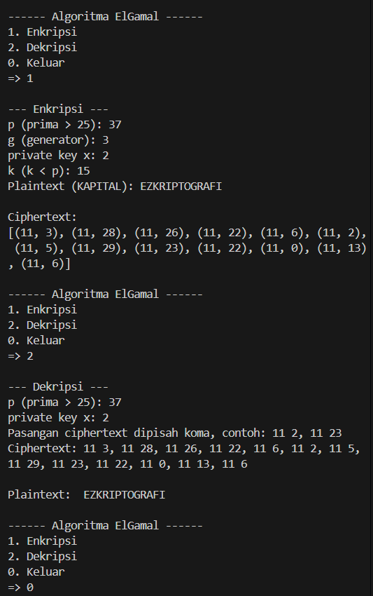

# ElGamal Cipher

Program ini adalah implementasi algoritma ElGamal Cipher untuk melakukan enkripsi text dan juga mendekripsinya.

---

## Alur Program

### 1. Fungsi Dasar
- mod_pow(base, exp, mod)  
  Digunakan untuk menghitung operasi seperti g^k mod p.

- mod_inverse(a, m)  
  Extended Euclidean Algorithm dalam proses dekripsi untuk mencari c^(-1).

---

### 2. Proses Enkripsi Awal
- encrypt_num(m, p, g, x, k)  
  Input:  
  - m = pesan/plaintext (0–25)  
  - p = bilangan prima (modulus)  
  - g = generator  
  - x = private key  
  - k = bilangan acak (kunci sesi)  

  Langkah:  
  1. Menghitung public key y = g^x mod p
  2. Menghitung a = g^k mod p 
  3. Menghitung b = (m * y^k) mod p  
  4. Pasangan ciphertext = (a, b)

---

### 3. Proses Dekripsi Awal
- decrypt_num(a, b, p, x)  
  Input:  
  - (a, b) = pasangan ciphertext  
  - p = bilangan prima  
  - x = private key  

  Langkah:  
  1. Menghitung c = a^x mod p  
  2. Mencari invers c_inv = c^(-1) mod p 
  3. Mengambalikan pesan: m = (b * c_inv) mod p

---

### 4. Konversi Huruf dan Angka
- char_to_num(ch) 
  Konversi huruf kapital ke angka A = 0 ... Z =25 

- num_to_char(n)  
  Konversi angka kembali ke huruf kapital 0 = A ... 25 = Z

---

### 5. Enkripsi Teks
- encrypt_text(text, p, g, x, k) 
  Untuk setiap huruf dalam 'text':  
  1. Konversi ke angka (char_to_num)  
  2. Enkripsi dengan encrypt_num  
  3. Simpan pasangan (a, b) ke ciphertext list

  Output berupa list ciphertext: [(a1, b1), (a2, b2), ...]

---

### 6. Dekripsi Teks
- decrypt_text(ct, p, x)  
  Untuk setiap pasangan (a, b) dalam ciphertext:  
  1. Dekripsi dengan 'decrypt_num'  
  2. Konversi hasil ke huruf (num_to_char).  
  3. Gabungkan menjadi string plaintext.

---

### 7. Menu Utama
- (1) Enkripsi  
  - Input: p, g, x, k, dan plaintext (dalam kapital)  
  - Output: list ciphertext (a, b)

- (2) Dekripsi  
  - Input: p, x, dan ciphertext (list pasangan (a b)).  
  - Output: plaintext (dalam kapital).

- (0) Keluar  
  - Mengakhiri program.

## Catatan
- Semua input huruf harus dalam kapital (A–Z)
- Nilai p harus bilangan prima lebih besar dari 25
- Nilai k harus lebih kecil dari nilai p

---

## Hasil Running Program

