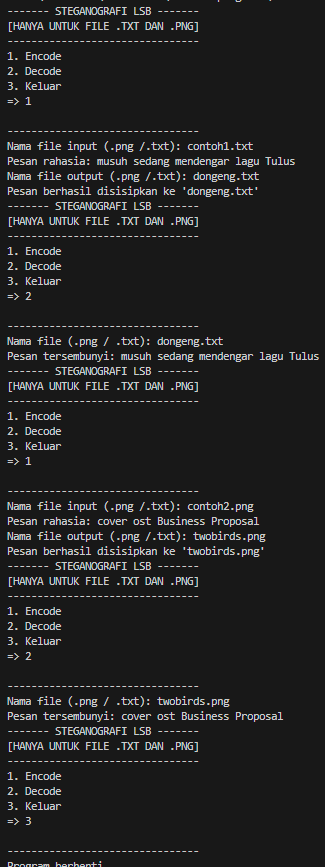

# Steganografi LSB (PNG dan TXT)

LSB (Least Significant Bit) adalah metode untuk menyembunyikan pesan dengan mengubah bit terakhir dari setiap byte pada data. Pada program ini, metode LSB diterapkan pada dua jenis file: PNG (gambar) dan TXT (teks).

---

## Cara Kerja

### Menu 1. Encode
**Input:**  
Nama file yang akan di-encode, pesan rahasia, dan nama file keluaran.

#### File .txt
- File dibuka dalam mode biner, lalu isinya dibaca sebagai bytearray.  
- Pesan rahasia diubah ke dalam bentuk biner, kemudian disisipkan ke dalam bit terakhir setiap byte teks dalam file.  
- Hasilnya disimpan ke dalam file teks baru sebagai hasil encode.

#### File .png
- Gambar dibuka menggunakan ibrary Pillow (PIL) agar dapat membaca nilai RGB dari setiap piksel.  
- Pesan rahasia diubah ke bentuk biner, kemudian disisipkan ke dalam bit terakhir tiap komponen warna RGB dari gambar secara berurutan.  
- Ditambahkan tanda khusus "###" di akhir pesan sebagai penanda akhir pesan.  
- File gambar baru disimpan sebagai hasil encode.

#### Catatan:
- Panjang pesan rahasia harus lebih kecil dari ukuran file

### Menu 2. Decode
**Input:**  
Nama file yang akan di decode.

#### File .txt
- Program membaca bit terakhir dari setiap byte, lalu mengumpulkannya menjadi rangkaian bit.  
- Bit-bit tersebut dikonversi kembali menjadi karakter teks untuk membentuk pesan rahasia.

#### File .png
- Program membaca bit terakhir dari setiap nilai RGB pada gambar secara berurutan.  
- Bit-bit hasil pembacaan diubah menjadi karakter teks.  
- Program berhenti membaca ketika menemukan tanda "###" sebagai akhir pesan.  
- Pesan hasil decode akan dicetak di layar.

---

### Menu 3. Keluar
Digunakan untuk mengakhiri atau keluar dari program.

---

## Hasil Running Program

