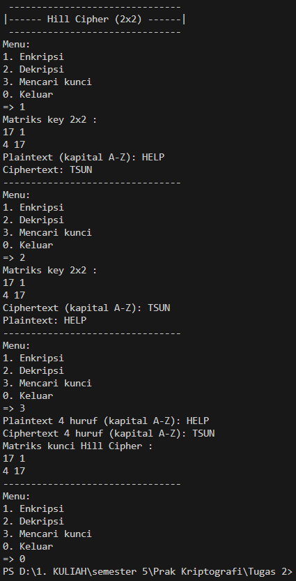

# Hill Cipher 2x2

Program ini adalah implementasi algoritma Hill Cipher dengan ukuran matriks kunci 2x2 yang dapat melakukan enkripsi, dekripsi, dan mencari kunci berdasarkan plaintext dan ciphertext.

---

## Alur Program

### 1. Menu Utama
Saat dijalankan program akan menampilkan menu pilihan:
- (1) Enkripsi
- (2) Dekripsi
- (3) Mencari kunci
- (0) Keluar

Pengguna memasukkan angka yang sesuai dengan pilihan.

---

### 2. Enkripsi
- Pengguna memasukkan matriks kunci 2x2
- Pengguna memasukkan plaintext dengan huruf kapital A–Z  
  Jika panjang plaintext ganjil, program akan menambahkan huruf `X`
- Program memproses plaintext per 2 huruf.  
  - Setiap huruf dikonversi ke angka (A=0,..., Z=25).
  - Dilakukan perkalian dengan matriks kunci mod 26
  - Hasil dikonversi kembali menjadi huruf
- Output berupa ciphertext.

---

### 3. Dekripsi
- Pengguna memasukkan matriks kunci 2x2
- Pengguna memasukkan ciphertext dengan huruf kapital A–Z  
- Program menghitung invers matriks kunci mod 26. 
  Jika determinan matriks tidak relatif prima terhadap 26, maka invers tidak ada dan dekripsi gagal
- Ciphertext diproses per 2 huruf menggunakan matriks invers 
- Output berupa plaintext.

---

### 4. Mencari Kunci
- Pengguna memasukkan 4 huruf plaintext
- Pengguna memasukkan 4 huruf ciphertext  
  Keduanya disusun menjadi matriks 2x2:
  - Matriks plaintext P
  - Matriks ciphertext C
- Program menghitung invers dari P  
  Jika invers tidak ada, proses berhenti.
- Matriks kunci dihitung dengan rumus: K = C x P^-1 (mod 26)
- Output berupa matriks K.

---

### 5. Keluar
Program berhenti jika pengguna memilih 0.

---

## Catatan
- Semua input huruf harus dalam kapital (A–Z).
- Matriks kunci valid jika determinannya relatif prima terhadap 26 (memiliki invers).
- Untuk mencari kunci, plaintext dan ciphertext hanya bisa 4 huruf dan harus membentuk matriks yang dapat diinvers.

---

## Hasil Running Program

