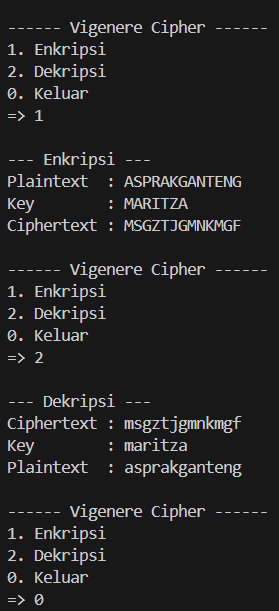

# Vigenere Cipher

Program ini mengimplementasikan algoritma Vigenere Cipher untuk melakukan enkripsi dan dekripsi teks dengan menggunakan kunci (key) yang diberikan pengguna.  

Rumus:
- **Enkripsi**: C = (P + K) mod 26  
- **Dekripsi**: P = (C - K + 26) mod 26  
  - P = huruf plaintext (0–25)  
  - C = huruf ciphertext (0–25)  
  - K = huruf key (0–25)  

## Alur Program
### 1. Menu Utama
  Saat dijalankan program akan menampilkan menu pilihan:
   - (1) Enkripsi
   - (2) Dekripsi
   - (0) Keluar
  Pengguna memasukkan angka yang sesuai dengan pilihan.

### 2. Fungsi Enkripsi
   - Input: plaintext dan key
   - Setiap huruf plaintext ('A-Z' atau 'a-z') digeser sesuai huruf key.
   - Hanya huruf yang diproses (spasi/tanda baca diabaikan).
   - Output: ciphertext.

### 3. Fungsi Dekripsi
   - Input: ciphertext dan key
   - Mengembalikan plaintext dengan menggeser huruf ciphertext mundur sesuai huruf key.
   - Hanya huruf yang diproses (spasi/tanda baca diabaikan).
   - Output: plaintext

---

## Hasil Running Program

